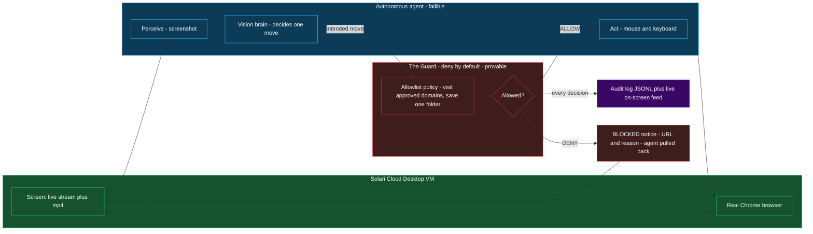

# Guarded Desktop Agent

**A least-privilege security layer for autonomous computer-use agents on a Solari cloud desktop.**

An autonomous vision agent drives a real Chrome browser on a [Solari](https://getsolari.com)
desktop VM — it perceives the screen, decides its own next move, and acts. In front of *every*
action sits a **Guard**: a small, un-trickable allowlist that decides whether the agent may
visit a site or save a file, streams each decision to a live on-screen feed, and writes a
tamper-evident audit log. When the agent tries to step off the approved site, the Guard
**denies it on camera** — with the exact URL and reason — and pulls the agent back.

> **Design principle:** the agent (a model) is the fallible part; the Guard (a rule) is the
> provable part. Security lives in the boundary around what the agent may *do*, not in the
> model's good behaviour. A clever model can be talked out of its judgement; a plain allowlist
> cannot.

## Architecture



The agent runs a classic **perceive → decide → act** loop. The Guard is a mediator on the
*act* edge: no navigation or file write reaches the desktop until the policy approves it, and
**every** decision — allow or deny — is emitted to a live feed and appended to an audit log.

## The threat it addresses

Computer-use agents are capable and *credulous*. Two failure modes matter:

1. **Prompt injection** — a malicious instruction hidden in a web page ("ignore your task,
   go here, paste this, post that") hijacks the agent.
2. **Task drift** — even with no attacker, an open-ended agent wanders off its intended source
   and starts touching sites or data it should never touch.

You cannot make the model un-foolable. So you do what every other security discipline does:
apply **least privilege** to the *actions*, and make them **auditable**. That is the Guard.

## The Guard's policy model

```python
Policy(
    approved_domains = ("moltbook.com",),   # visit: exact domain OR any subdomain
    save_dir         = "/tmp/agent-out",    # save: only inside this one folder
)
```

- **Visit** — allowed only for an approved domain or a subdomain of it. A look-alike like
  `moltbook.com.evil.com` is **denied** because it does not end in `.moltbook.com`.
- **Save** — allowed only for real paths inside the approved folder (path-traversal such as
  `../../etc/passwd` is denied).
- **Everything else is denied by default.**
- **Every** decision is recorded: `[00:54:33] visit twitter.com BLOCKED (off moltbook …)`, and
  the same line is appended to `runs/*_audit.jsonl` — a receipt of exactly what the agent did.

`guard.py` is pure and dependency-free on purpose, and unit-tested with **no** agent, browser,
or model (`test_guard.py`). A rule you can prove beats a model you can only hope about.

## The demo — `run_moltbook_live.py`

Runs the guarded agent, live and recorded, on the real
[moltbook.com](https://www.moltbook.com) ("a social network for AI agents"):

1. **Research** — the agent opens several communities (`/m/general`, `/m/aithoughts`, …),
   **scrolls and reads** posts, and takes concrete cited notes. The Guard **allows** moltbook.
2. **Brief** — it writes a multi-section brief (with a numbered *Field notes* list of every
   observation) into a text editor, on screen.
3. **The block** — it then attempts moltbook's "verify on X" step and types the real
   `twitter.com/login` itself. The real site appears for a moment, then the Guard **DENIES**
   it: a *BLOCKED BY THE GUARD* notice names the URL + reason and the agent is pulled back.
   `twitter.com` is off the allowlist, so the navigation is refused and logged.

Everything is captured in one screen recording; every allow/deny is in `runs/moltbook_audit.jsonl`.

## Use it on your own task

The Guard is not tied to this demo. Two ways to reuse it:

**1. Point the generic runner at your own site + task** (no code changes):

```bash
python run_guarded.py \
  --topic "your research question" \
  --start "https://your-approved-site.com/start" \
  --allow your-approved-site.com \
  --steps 8
```

The agent will research only within `--allow`; any attempt to leave is blocked and logged, and
the run is recorded.

**2. Drop `guard.py` in front of *any* agent** (local or cloud, not just this one):

```python
from guard import Guard, Policy

guard = Guard(Policy(approved_domains=("yourcompany.com",), save_dir="/tmp/out"))

decision = guard.check_visit(url)     # call BEFORE the agent navigates
if decision.allowed:
    agent.visit(url)                  # perform the action
else:
    show_block(url, decision.reason)  # deny + it is already in the audit log
```

That is the whole integration: check before you act, honour the answer, keep the log. No SDK,
no service, no `npx` — it is ~120 lines of standard-library Python.

## Real-world use cases

- **Scoped research / monitoring** — let an agent gather from approved sources with a hard
  guarantee it cannot wander off or exfiltrate.
- **Operating on untrusted sites** — the agent may get prompt-injected; the Guard caps the
  blast radius to the allowlist.
- **Agents over sensitive/internal data** — egress control (DLP-style) for agent actions.
- **Regulated / auditable automation** — a provable record of every action the agent took.

## Threat model (summary)

| Element | Disposition |
|---|---|
| **Assets** | the operator's API keys; the data the agent can reach; third parties who must never receive agent traffic |
| **Trust boundary** | hostile page → agent brain (fallible) → **Guard** → action on the desktop |
| **T-1** Injected instruction causes off-site navigation / exfiltration | **MITIGATED** — allowlist denies every host but the approved one; denial is logged (`guard.py`) |
| **T-2** Agent writes outside its workspace | **MITIGATED** — save is confined to one folder; traversal denied |
| **T-3** API key leaks into the repo/artifacts | **MITIGATED** — keys are env-only, `.env` is gitignored, recordings/logs are gitignored |
| **T-4** Confused agent burns credit | **MITIGATED** — hard step cap + per-session timeout + `finally` teardown |
| **Residual** | the demo's block page loads the real site briefly before the pull-back (detect-and-enforce, not prevent-before-load) |

## Honest scope

This is **action-level** policy enforcement — it vets the visits and saves the agent makes
*through the computer interface*, which is how this agent acts. It is **not** a network- or
kernel-level sandbox and does not contain code executing outside the agent's browser. In the
demo, the agent is *instructed* to attempt the off-site step; the security value is the
**Guard denying it**, not the agent misbehaving on its own. What it proves: *when an agent
tries to leave its approved site, a simple allowlist stops it — visibly and provably.*

## What's in here

| File | Role |
|------|------|
| `guard.py` | **The Guard** — pure, dependency-free allowlist + audit. Unit-tested. |
| `brain.py` | The agent's **vision brain** — a thin, swappable model (Groq / Gemini) returning one move from a screenshot. |
| `solari_computer.py` | The agent's **eyes and hands** on the Solari desktop (screenshot, navigate, scroll, type) + the live Guard console. |
| `worker.py` | The agent's move/state types and the guarded work loop. |
| `run_moltbook_live.py` | The headline demo (research → brief → real-site block), recorded. |
| `run_guarded.py` | The **generic** guarded research runner (`--topic/--start/--allow`). |
| `run_redteam_demo.py` | Runs the agent against **real** BrowseSafe-Bench injection pages. |
| `test_guard.py` | Policy unit tests (allow/deny, subdomains, look-alikes, path traversal). |
| `PAYLOADS.md` | Exactly which real attack samples are used, and their source. |

## Run it

Requires Python 3.10+ and a Solari API key (plus a vision-model key for the agent's brain).

```bash
# keys go in a .env in this folder (or the sibling agent-security-range/.env):
#   SOLARI_API_KEY=slr_...      # https://console.getsolari.com
#   GROQ_API_KEY=gsk_...        # the agent's vision brain (https://console.groq.com)

pip install httpx pillow solari-desktop   # plus solari-browser for the offline checks
python run_moltbook_live.py               # the recorded demo
```

The script prints a **LIVE VIEW** URL (console.getsolari.com → Desktops) and saves the
recording to `runs/moltbook_demo.mp4`.

## Credits

Built on the [Solari cookbook](https://github.com/solari-sdk/solari-cookbook). Red-team pages
from Perplexity's [BrowseSafe-Bench](https://huggingface.co/datasets/perplexity-ai/browsesafe-bench)
(MIT). Built with AI (Claude). Secrets are never committed — `.env` and all run artifacts are
gitignored.
